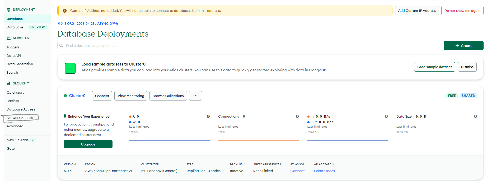

### MongoDB Atlas 구성하기

---

- Mongo DB ? 오픈소스 `NoSQL` DB
    - `NoSQL` ? JSON, Key-Value, 그래프 등의 형태로 유연하게 데이터 저장이 가능한 DB
    - `Database` → `Collections` → `Documents`의 형태로 데이터 저장

- MongoDB Atlas ? MongoDB를 **클라우드** 환경에서 사용 가능
1. Project 만들기

1. DataBase(Cluster) 구성

- 구성 후 Database의 Network Access에서 Add IP 설정
    - DB에 접근 가능한 IP 설정
    - 배포 시엔 서버 IP를 적어주면 됨

- DataBase Access에서 User 정보 입력

- MongoDB를 GUI 환경에서 사용하려면 MongoDB Compass 설치
    - 설치 후 코드 입력

- MongoDB Compass에서 Create Database 시도
    - 권한 오류 발생 시 유저 권한을 `Atlas Admin`으로 변경

                                                                           Atlas admin으로 Role 수정 하기

### MongoDB CRUD 명령어 확인

---

- CRUD ? **C**reate, **R**ead, **U**pdate, **D**elete

- Database - Collections - Documents 사이 관계 확인!

**기본 명령어**

- `db` : 현재 사용 중인 DB 정보 확인
- `use` db 이름 : 해당 이름의 DB로 전환
- db.collection이름.`insertOne({"key" : "value"})` : 해당 Collection에 데이터(Document) 추가
- db.collection이름.`find()` : 해당 Collection 내 모든 데이터 조회
- db.collections이름.`updateOne`({조건}, {수정 사항}) : 조건에 맞는 데이터를 찾아 수정
- db.collections이름.`deleteOne`({조건}) : 조건에 맞는 데이터 삭제