### 목차
- [Static pages(정적 페이지)와 Dynamic pages(동적 페이지) 알아보기](#static-pages정적-페이지와-dynamic-pages동적-페이지-알아보기)
  - [Static pages(정적 페이지)](#static-pages정적-페이지)
  - [Dynamic pages(동적 페이지)](#dynamic-pages동적-페이지)
- [Web Server(웹 서버)와 CGI, Web Application Server(WAS, 앱 서버) 알아보기](#web-server웹-서버와-cgi-web-application-serverwas-앱-서버-알아보기)
  - [Web Server(웹 서버)](#web-server웹-서버)
  - [Common Gateway Interface(CGI)](#common-gateway-interfacecgi)
  - [CGI 문제점 보완 → 처리 프로세스 상주](#cgi-문제점-보완--처리-프로세스-상주)
  - [Web Application Server(WAS, 앱 서버)](#web-application-serverwas-앱-서버)
  - [왜 WAS랑 웹 서버 함께 사용?!](#왜-was랑-웹-서버-함께-사용)
- [FastAPI과 함께 사용되는 ASGI(Uvicorn) 알아보기](#fastapi과-함께-사용되는-asgiuvicorn-알아보기)
  - [ASGI?](#asgi)
  - [ASGI 비교](#asgi-비교)
  - [Hypercorn이 Uvicorn 보다 덜 사용되는 이유?](#hypercorn이-uvicorn-보다-덜-사용되는-이유)
- [FastAPI 설치 및 기본 사용법 알아보기](#fastapi-설치-및-기본-사용법-알아보기)
  - [1. FastAPI, Uvicorn 설치](#1-fastapi-uvicorn-설치)
  - [2. FastAPI 서버 생성 및 실행](#2-fastapi-서버-생성-및-실행)
  - [3. 현재 서버의 API 확인 → Swagger UI, ReDoc](#3-현재-서버의-api-확인--swagger-ui-redoc)
- [Jinja2 Templates Engine 사용하기](#jinja2-templates-engine-사용하기)
  - [Jinja Templates?](#jinja-templates)
  - [Jinja Template 사용 간단 예제](#jinja-template-사용-간단-예제)
  - [@app.get에서 사용되는 Request?](#appget에서-사용되는-request)
  - [CSS 적용을 간단하게 → MVP.css](#css-적용을-간단하게--mvpcss)

## Static pages(정적 페이지)와 Dynamic pages(동적 페이지) 알아보기

### Static pages(정적 페이지)

---


html, css, javascript 등으로 **미리 작성**된 **파일** 등을 서버에 저장해 놓고, 매 클라이언트 **요청**마다 **동일한 페이지**를 반환하는 경우다. 동적인 요소가 없기 때문에 별도의 DB 없이 `Web Server`(웹 서버)만으로 **처리**할 수 있는 영역이다.

미리 저장된 파일을 불러오기 때문에 **로딩** 자체가 **빠르**고, 공격적인 캐시 설정을 통해 이를 극대화할 수 있다는 장점이 있다. 다만 페이지 **내용 변경** 시 서버에 업로드해야 하는 과정이 필요한 만큼, 수정이 **불편**한 단점이 있다.

</br>

### Dynamic pages(동적 페이지)

---


클라이언트 요청에 따라 데이터를 **가공**해 맞춤형 결과를 반환하는 경우다. 동적 페이지를 위해선 Web Application Server(**WAS**)와 **DB**가 필요하며, 추가적인 서버 요청도 필요하다. 

사용자 별 맞춤 결과를 보여줄 수 있다는 것이 큰 장점이다. 당연하게도 로딩 속도가 느리고, 내용이 계속 변경되는 만큼 캐시 사용도 어렵다.

---

******참고******

[LINE에서 하루 만에 정적 웹 페이지 개발해서 배포하는 방법](https://engineering.linecorp.com/ko/blog/how-to-quickly-develop-static-pages-in-line)

[정적, 동적 웹페이지 차이는?](https://velog.io/@ppyooy336/정적-동적-웹페이지-차이는)

## Web Server(웹 서버)와 CGI, Web Application Server(WAS, 앱 서버) 알아보기

### Web Server(웹 서버)

---

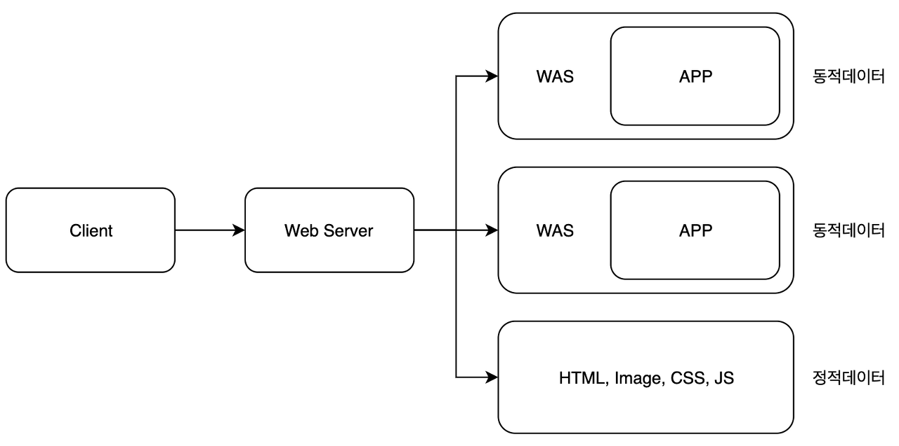

                                                  Client 요청과 Web Server 응답 개요

클라이언트로부터 **HTTP** 요청을 받아 Static pages(**정적** 페이지)를 **제공**하거나, Dynamic Pages(**동적** 페이지) 요청을 **WAS**에 전달 하는 **서버** 및 **프로그램**을 의미한다. 서버가 설치된 PC 자체를 가리키는 말이기도 하다.

<br/>

- 예시) `Apache`, `Nginx`

<br/>

### Common Gateway Interface(CGI)

---

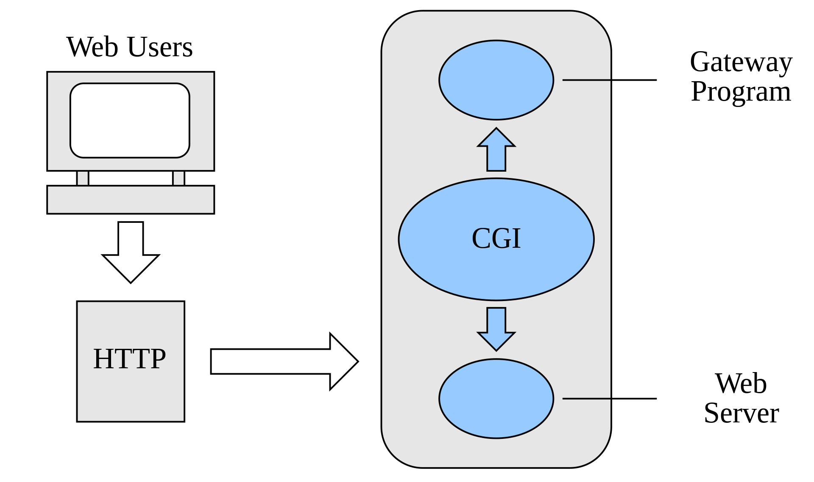

                     CGI = Web Server와 Program 사이 프로토콜

Web Server(웹 서버)와 Application Program 사이 정보를 주고 받는 **프로토콜**이다. **CGI**를 통해 웹 서버가 Dynamic Pages(**동적 페이지**) **구성**을 할 수 있다. 프로토콜이기 때문에 어떤 언어로도 작성될 수 있다. 

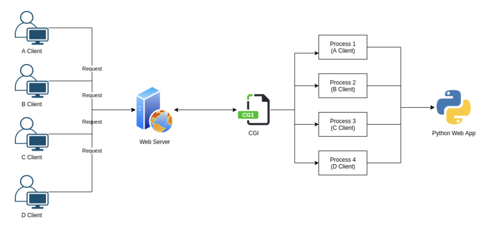

                                          CGI : 클라이언트 요청에 따라 프로세스를 생성

CGI는 클라이언트 요청을 처리 하기 위해 매번 Process(**프로세스)**를 새로 생성한다. 따라서 많은 요청이 발생할 경우 **메모리 사용량**이 커지는 문제가 발생한다. 

<br/>

### CGI 문제점 보완 → 처리 프로세스 상주

---

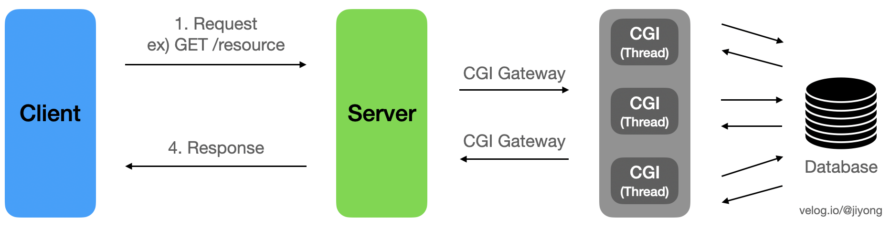

                                                     Java의 servlet은 Thread(스레드)로 처리해서 개선

요청마다 **프로세스**를 새로 생성하기 때문에 **메모리** 사용량이 커지는 것이 CGI의 문제였다. 이를 해결하기 위해 웹 서버에 Interpreter(인터프리터) 프로세스를 상주 시켜 성능을 개선했다.

<br/>

### Web Application Server(WAS, 앱 서버)

---

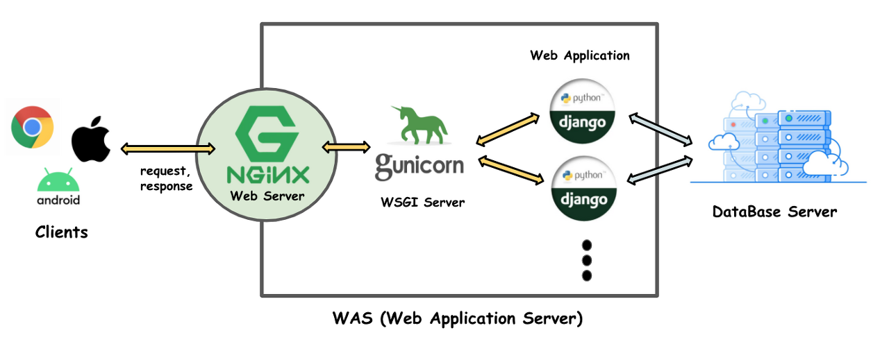

                                                                                    

웹 서버와 달리 Dynamic Pages(**동적** 페이지)를 전달해줄 수 있는 **서버** 및 **프로그램**을 의미한다. WAS는 **CGI** 프로토콜을 활용해 **Application** 사이 통신으로 동적 페이지를 제공한다. 따라서 `WAS = Web Server + CGI` 이다. 다만 일반적으로 WAS를 얘기할 때는 Web Server(CGI) + Application 까지 포함된 개념을 뜻한다.

<br/>

- WSGI : Python 전용 CGI 중 하나

<br/>

### 왜 WAS랑 웹 서버 함께 사용?!

---


그림을 보면 웹 서버(Nginx)와 WAS(WSGI)가 함께 존재하는 것을 확인할 수 있다. 왜 굳이 서버를 2개나 쓰냐 하면, 웹 서버(Nginx)를 **Reverse Proxy** 서버로서 사용할 수 있기 때문이다. Reverse Proxy 서버 사용 시 다음과 같은 장점이 있다.

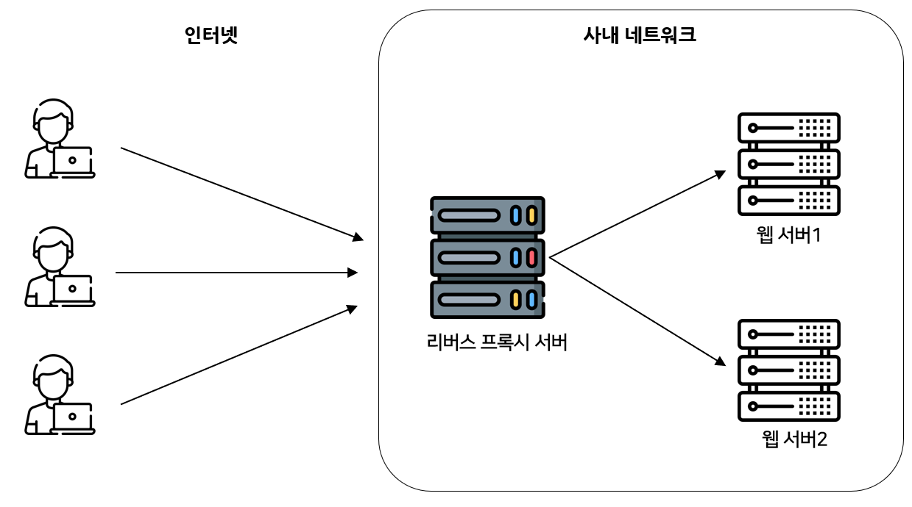

                               Reverse Proxy 서버 사용 시, 네트워크 구성

1. **Load Balancing** : 특정 서버에 트래픽이 몰려 과부화가 발생하는 것을 막는다.

2. **보안 우수** : 웹 서버 1, 2…의 IP를 노출하지 않기 때문이다.

3. **캐시 사용 : **Reverse Proxy에 캐시 데이터를 저장해두고 활용할 수 있다.

4. **SSL 암호화 도움** : 구조 자체가 암호 및 복호화에 적합

---

**참고**

[https://chrisjune-13837.medium.com/web-웹서버-앱서버-was-app이란-692909a0d363](https://chrisjune-13837.medium.com/web-웹서버-앱서버-was-app이란-692909a0d363)

[https://velog.io/@jimin_lee/Nginx와-Gunicorn-둘-중-하나만-써도-될까](https://velog.io/@jimin_lee/Nginx와-Gunicorn-둘-중-하나만-써도-될까)

[https://bentist.tistory.com/40](https://bentist.tistory.com/40)

## FastAPI과 함께 사용되는 ASGI(Uvicorn) 알아보기

### ASGI?

---

- Application Program(FastAPI)와 Web Server(웹 서버) 사이의 통신을 돕는 Middleware(**미들웨어**)

	- FastAPI의 실행 결과를 웹 서버)에 전달하고, 웹 서버는 ASGI로 전달 받은 응답 결과를 클라이언트에 전달

	- WSGI와 다른 점은 비동기 처리가 가능하다는 것!

- 예) `Uvicorn`, `Hypercorn`, `Daphne`

<br/>

### ASGI 비교  

---

- Hypercorn

	- HTTP/2 및 Trio와 호환되는 ASGI 구현체

	- asyncio, uvloop도 쓸 수 있다고 함!

- Daphne

	- Django와 Twisted와 호환되는 ASGI 구현체

	- 상대적으로 느리다고 함

- Uvicorn

	- FastAPI 공식 추천 ASGI 구현체

	- 가장 빠른 속도를 자랑함

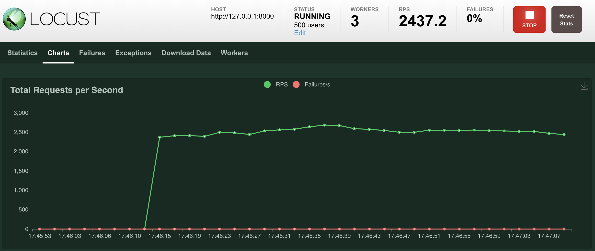

                                    Uvicorn
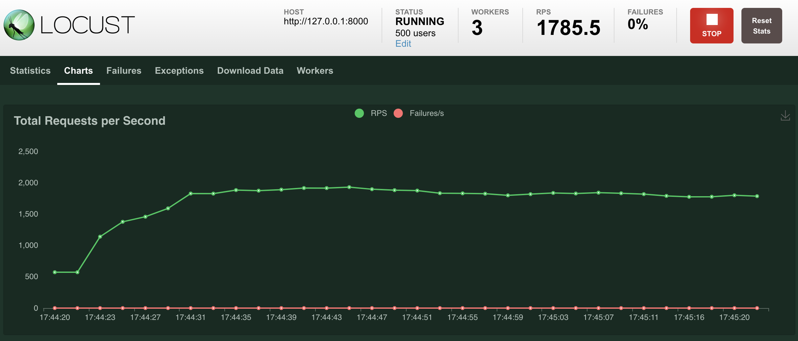

                                    Hypercorn
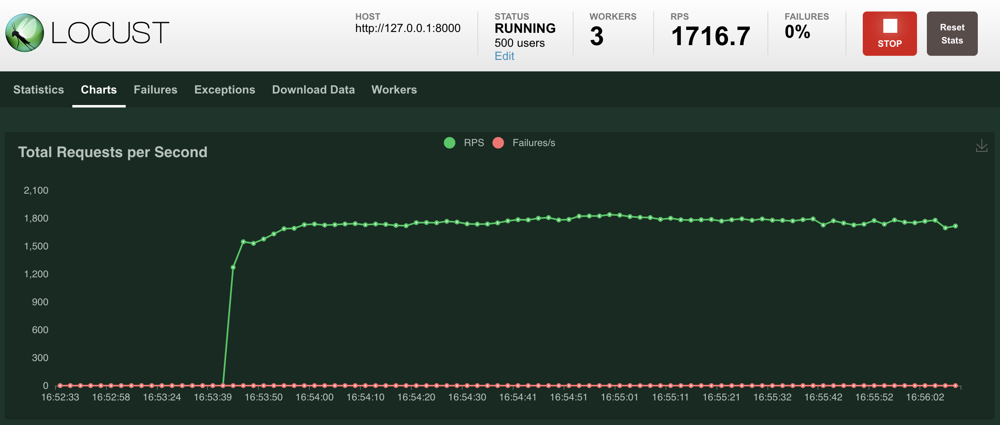

                                    Daphne

### Hypercorn이 Uvicorn 보다 덜 사용되는 이유?

---


```python
ChatGPT 피셜로 정확한 사실 관계와는 다를 수 있음.
```

- Hypercorn은 거의 모든 것을 지원하는 거 같은데 왜 별로 안 쓰이나??

	- 지원하는 것이 많아서 좋긴 한데, 또 그 만큼 dependencies 도 많고 복잡함

	- 실제로 gunicorn(WSGI)과 쉽게 사용할 수 있는 Uvicorn과 달리, Hypercorn은 그 절차가 복잡하다고 함

- 그래서 그런지 User Comunity도 덜 활성화 됨

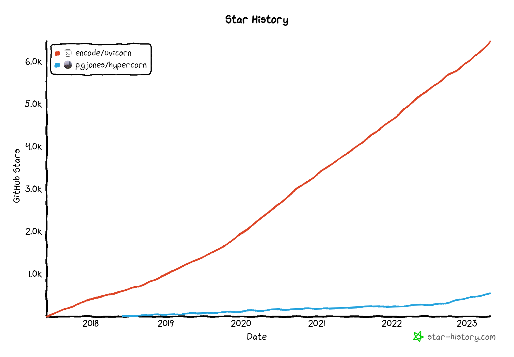

                                                         차이가 좀 많이 난다 ㅎㅎ…

---

**참고**

[https://kangbk0120.github.io/articles/2022-02/cgi-wcgi-asgi](https://kangbk0120.github.io/articles/2022-02/cgi-wcgi-asgi)

[https://dev.to/bowmanjd/the-three-python-asgi-servers-5447](https://dev.to/bowmanjd/the-three-python-asgi-servers-5447)

<br/>

## FastAPI 설치 및 기본 사용법 알아보기

### 1. FastAPI, Uvicorn 설치

---

- `FastAPI` 설치


```python
pip install fastapi
```

- `Uvicorn` 설치


```python
pip install uvicorn[standard]
```

<br/>

### 2. FastAPI 서버 생성 및 실행

---

- `main.py` 파일에 서버 정보 입력

	- `@app.get(”/”)` : 서버(127.0.0.1:8080)에 GET 요청이 발생할 경우 보여줄 내용

	- `@app.get(”/items/{item_id}”)` : items/{item_id}에 GET 요청이 발생할 경우 보여줄 내용

- `app = FastAPI()`는 1개만 존재

	- Singleton(싱글톤) 패턴


```python
from typing import Union

from fastapi import FastAPI
# FastAPI 객체는 1 개만 존재 -> 싱글톤 패턴
app = FastAPI()

# Decorator를 사용해서 app에 미리 정의된 .get 함수 기능 수행
@app.get("/")
def read_root():
    return {"Hello": "World"}

# {} -> Dynamic Routing(동적 라우팅)
# 다중 지정 가능
@app.get("/items/{item_id}")
def read_item(item_id: int, q: Union[str, None] = None):
    return {"item_id": item_id, "q": q}
```

- 서버 실행하기

	- `app` : FastAPI

	- `--reload` : 코드 변경 후 서버 재 시작 


```python
uvicorn 경로.main:app --reload
```

- 서버 실행 후 `http://127.0.0.1:8000/items/5?q=somequery` 입력

	- `127.0.0.1` : Local Host 주소

	- `/items/{item_id}` : GET 요청을 통해 `read_item` 함수 실행 결과 반환

		- {} : Dynamic Routing(동적 라우팅) 정보 전달

	- `?q=somquery` : `?`를 사용해 q의 `파라미터`로 somequery 함께 전달


```python
{
  "item_id": 5,
  "q": "somequery"
}
```

- URL 주소 양식 (펼쳐 보기)

	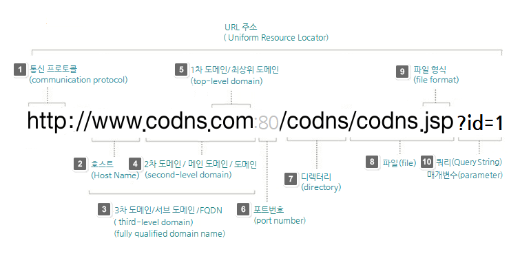

	[http://www.codns.com/b/B05-195](http://www.codns.com/b/B05-195)

<br/>

### 3. 현재 서버의 API 확인 → Swagger UI, ReDoc

---

- `http://127.0.0.1:8000/docs`

	- Swagger UI : 대화형 API 문서

		- 값을 입력하면 `JSON` 형태로 반환함

	- ReDoc : 결과만 확인 가능

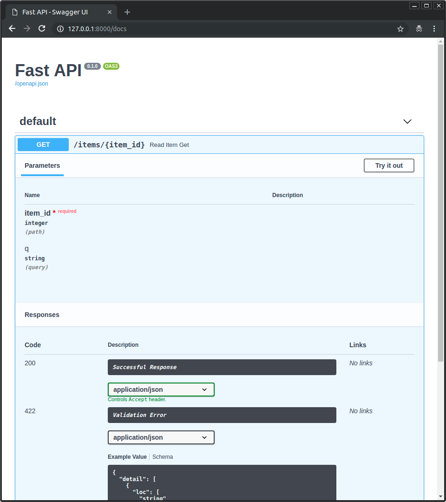

</br>

## Jinja2 Templates Engine 사용하기

### Jinja Templates?

---

- 기존에 구성한 간단한 `main.py`의 응답은 JSON 객체였음
- `HTML` 파일을 간단하게 렌더링할 수 있도록 도와주는 것이 바로 `Jinja Template`
 
- Template이랑 Temple 발음이 유사해서 Jinja라는 이름이…

### Jinja Template 사용 간단 예제

---

- main.py에서 다음과 같은 코드를 구성하여 Jinja Template 활용
    - Template 사용 시 기본 구조

```bash
|-- app
|   |-- main.py
|   `-- templates
|       `-- item.html
```

- `main.py`

```python
# main.py
from fastapi import FastAPI, Request
from fastapi.responses import HTMLResponse
from fastapi.templating import Jinja2Templates
from pathlib import Path

BASE_DIR = Path(__file__).resolve().parent # app 경로를 절대 경로로 지정

app = FastAPI()

templates = Jinja2Templates(directory=f"{BASE_DIR}/templates") # dir : serving할 HTML 파일 위치 -> 절대 경로 지정

# 라우팅 : 요청받은 URL을 해석 하여 그에 맞는 함수를 실행하고, 결과를 리턴하는 행위
@app.get("/items/{id}", response_class=HTMLResponse) # response_class : Jinja를 사용하니 HTML
async def read_item(request: Request, id: str):
    return templates.TemplateResponse("item.html", {"request": request, "id": id})
```

- `templates/item.html`

```html
<!--templates/item.html-->
<html>
<head>
    <title>Item Details</title>
</head>
<body>
		<!--read_item을 통해 받은 id를 H1 태그로-->
    <h1>Item ID: {{ id }}</h1>
</body>
</html>
```

### @app.get에서 사용되는 Request?

---

- `app.get` : Type Hint를 통해서 request 여부 확인

```python
# 라우팅 : 요청받은 URL을 해석 하여 그에 맞는 함수를 실행하고, 결과를 리턴하는 행위
@app.get("/items/{id}", response_class=HTMLResponse) # response_class : Jinja를 사용하니 HTML
async def read_item(request: Request, id: str):
    return templates.TemplateResponse("item.html", {"request": request, "id": id})
```

- `request` : Client - Server 사이의 요청 정보가 저장돼 있는 객체
    - `print(dir(request))`

```python
['__abstractmethods__', '__annotations__', '__class__', '__class_getitem__', '__contains__', '__delattr__', '__dict__', '__dir__', '__doc__', '__eq__', '__format__', '__ge__', '__getattribute__', '__getitem__', '__gt__', '__hash__', '__init__', '__init_subclass__', '__iter__', '__le__', '__len__', '__lt__', '__module__', '__ne__', '__new__', '__orig_bases__', '__parameters__', '__reduce__', '__reduce_ex__', '__repr__', '__reversed__', '__setattr__', '__sizeof__', '__slots__', '__str__', '__subclasshook__', '__weakref__', '_abc_impl', '_cookies', '_form', '_get_form', '_headers', '_is_disconnected', '_is_protocol', '_query_params', '_receive', '_send', '_stream_consumed', 'app', 'auth', 'base_url', 'body', 'client', 'close', 'cookies', 'form', 'get', 'headers', 'is_disconnected', 'items', 'json', 'keys', 'method', 'path_params', 'query_params', 'receive', 'scope', 'send_push_promise', 'session', 'state', 'stream', 'url', 'url_for', 'user', 'values']
```

### CSS 적용을 간단하게 → MVP.css

---

- HTML 코드 수정 없이 CSS 적용해줌

```html
<link href="https://unpkg.com/mvp.css" rel="stylesheet">
```